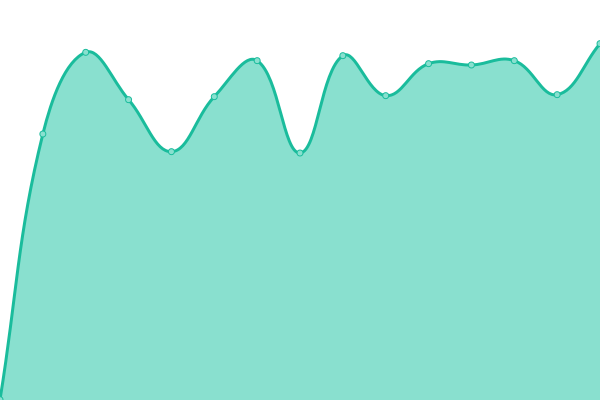
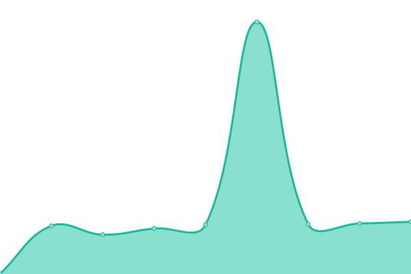
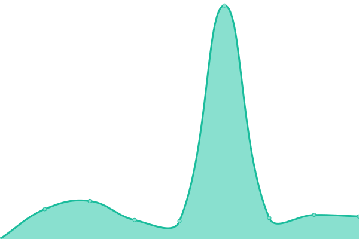

# [📈 Live Status](https://status.dylanvanassche.be): <!--live status--> **🟩 All systems operational**

This repository contains the open-source uptime monitor and status page for [Upptime](https://upptime.js.org), powered by [Upptime](https://github.com/upptime/upptime).

With [Upptime](https://upptime.js.org), you can get your own unlimited and free uptime monitor and status page, powered entirely by a GitHub repository. We use [Issues](https://github.com/upptime/upptime/issues) as incident reports, [Actions](https://github.com/DylanVanAssche/status-page/actions) as uptime monitors, and [Pages](https://status.dylanvanassche.be) for the status page.

<!--start: status pages-->
<!-- This summary is generated by Upptime (https://github.com/upptime/upptime) -->
<!-- Do not edit this manually, your changes will be overwritten -->
<!-- prettier-ignore -->
| URL | Status | History | Response Time | Uptime |
| --- | ------ | ------- | ------------- | ------ |
|  [Personal website](https://www.dylanvanassche.be) | 🟩 Up | [personal-website.yml](https://github.com/DylanVanAssche/status-page/commits/HEAD/history/personal-website.yml) | 

 524ms
     
 | 

<a href="https://status.dylanvanassche.be/history/personal-website">100.00%</a>
    

|  [Matrix](https://chat.dylanvanassche.be) | 🟩 Up | [matrix.yml](https://github.com/DylanVanAssche/status-page/commits/HEAD/history/matrix.yml) | 

 1023ms
     
 | 

<a href="https://status.dylanvanassche.be/history/matrix">90.36%</a>
    

|  [Riot](https://riot.dylanvanassche.be) | 🟩 Up | [riot.yml](https://github.com/DylanVanAssche/status-page/commits/HEAD/history/riot.yml) | 

 608ms
     
 | 

<a href="https://status.dylanvanassche.be/history/riot">100.00%</a>
    

|  [Radicale](https://caldav.dylanvanassche.be) | 🟩 Up | [radicale.yml](https://github.com/DylanVanAssche/status-page/commits/HEAD/history/radicale.yml) | 

 936ms
     
 | 

<a href="https://status.dylanvanassche.be/history/radicale">89.79%</a>
    

|  [Thesis](https://thesis.dylanvanassche.be) | 🟩 Up | [thesis.yml](https://github.com/DylanVanAssche/status-page/commits/HEAD/history/thesis.yml) | 

 587ms
     
 | 

<a href="https://status.dylanvanassche.be/history/thesis">100.00%</a>
    

|  [Sailfinder](https://sailfinder.dylanvanassche.be) | 🟩 Up | [sailfinder.yml](https://github.com/DylanVanAssche/status-page/commits/HEAD/history/sailfinder.yml) | 

 568ms
     
 | 

<a href="https://status.dylanvanassche.be/history/sailfinder">100.00%</a>
    

|  [Daports](https://repo.dylanvanassche.be) | 🟩 Up | [daports.yml](https://github.com/DylanVanAssche/status-page/commits/HEAD/history/daports.yml) | 

 510ms
     
 | 

<a href="https://status.dylanvanassche.be/history/daports">100.00%</a>
    

|  [De Pijl VZW](https://www.de-pijl.be) | 🟩 Up | [de-pijl-vzw.yml](https://github.com/DylanVanAssche/status-page/commits/HEAD/history/de-pijl-vzw.yml) | 

 604ms
     
 | 

<a href="https://status.dylanvanassche.be/history/de-pijl-vzw">100.00%</a>
    

<!--end: status pages-->

[**Visit our status website →**](https://status.dylanvanassche.be)

## 📄 License

- Powered by: [Upptime](https://github.com/upptime/upptime)
- Code: [MIT](./LICENSE) © [Upptime](https://upptime.js.org)
- Data in the `./history` directory: [Open Database License](https://opendatacommons.org/licenses/odbl/1-0/)
